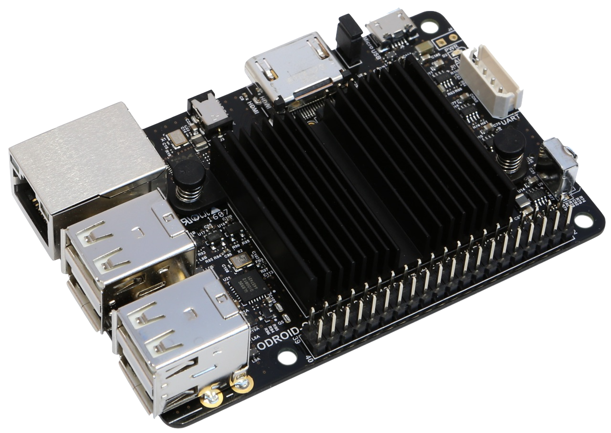
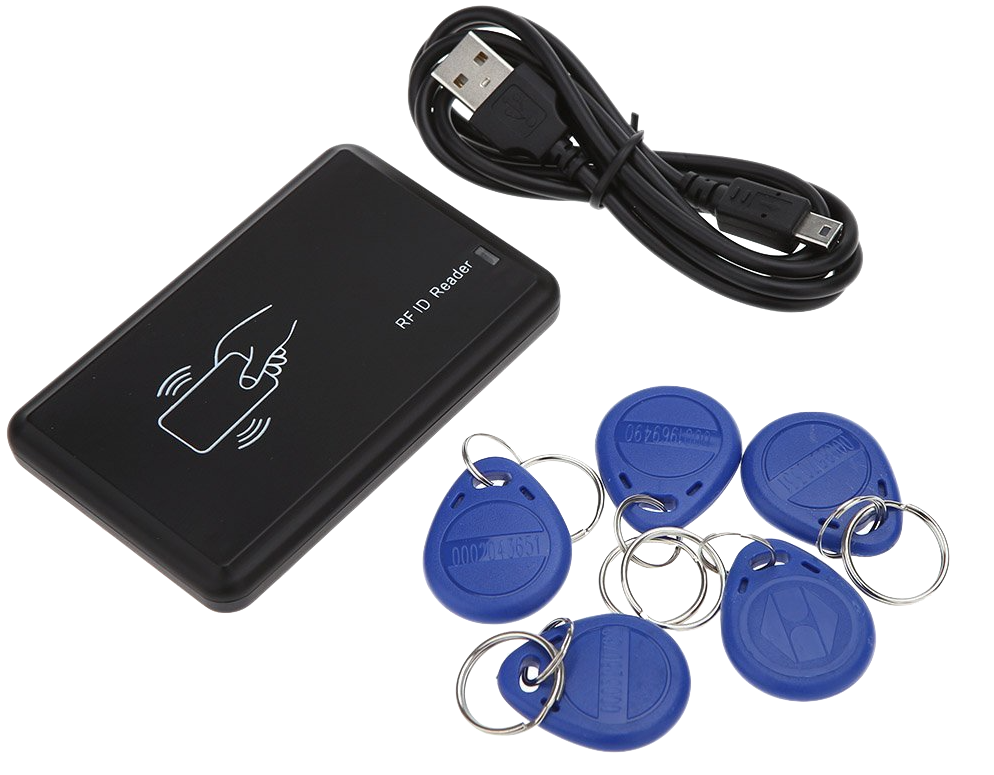
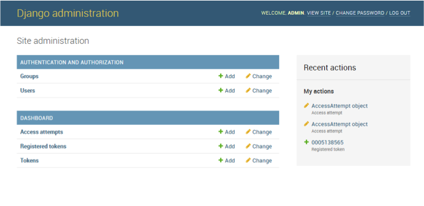
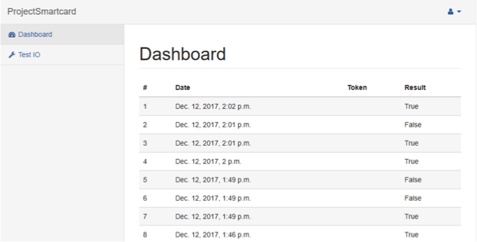
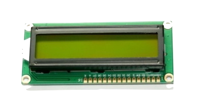

# Simple checkin example

This project is a simple demo or “how to” that demonstrate how easy it is to realize a simple device for “access control”, with a little effort.
It’s based on an IOT board Odroid-C2 (in the image below) that combines enough power to run a web server, for the remote management (even too much powerful), with the GPIO interface to control other devices.
In this case even USB was needed but there are RFID reader that can be attached directly to the GPIO.



# The Project

The project was developed on a Debian based distribution, for IOT devices, named [DietPi](http://dietpi.com).
This because is easy to install and perfectly compatible to the board.
To install the OS is only necessary to write the image to the SD card and then plug it into the board.
The project structure is bassed upon three different components:
- A part for read the input (in this case RFID).
- One to output information to the user.
- A web interface to manage the system.

## Rfid

The Rfid reader used in this project simulates a keyboard, so it appears to the OS as an input device.
It works writing the ids as a series of keyboard button pressed and released followed by an "Enter" key press.
For this reason the part of the project that manage the input combine two utility: one to be able to detect the right input device between the attached ones; and another one for listen on the input stream and send the token to the process that manage the authentication each time an "enter" is received.
Is derived from the Debian module [input-utils](https://packages.debian.org/sid/utils/input-utils) ([git url](git://git.debian.org/collab-maint/input-utils.git)).
The device used is visible below.



## Web interface 

The web console is the part of the project that allow to configure in a simple way which token are allowed or not, assgin a token to a user or show the log of the authentication attempts.
Another page allow to test the output on the GPIO.
It also contains the code that synchronize the comunication from the other two components (rfid and output).
Is based upon Python 2.7 and [Django](https://www.djangoproject.com) 1.11. 



The first image (the one above) is the standard Django administration page that allow to interact with the database content.
The image below show the dashboard based on the [SbAdmin2](https://startbootstrap.com/template-overviews/sb-admin-2/) template.



## GPIO Output

This part of the project is intended to provide some feedback to the user that try to use the rfid to authenticate itself.
Something like authentication accepted or rejected.
To achive this goal various components was used: 
- A display HD44780 compatible.
- Two led (one red and one green).
- A button.
- A buzzer.



To control the pin of the IO interfase was used the WiringPi libray, that allow to write on the display with only few lines of code.

# Install

To test the project there are few step to do.
First setup the board installing DietPi.
Then install the base utility:
1. C compiler
2. Python 2.7 and pip
3. Django 1.11
4. WiringPi
5. etc ...

After that you are ready to clone the repository and build the project running the command:
```bash
make
```

At this point you have to prepare and run Django:
```bash
# setup the django ORM
python manage.py migrate
# create a admin user for the console
python manage.py createsuperuser
# serve the website
python manage.py runserver 0.0.0.0:80 --runonce
```

Then to setup the output and input (rfid part) is simply necessary to start the two exe builded with the make command above.
```bash
# to show the available input device and locate the right one
./rfid/main
# to start listening event run: main (number of device)
./rfid/main 1 &
# and then to start the output process
./output/output &
```
